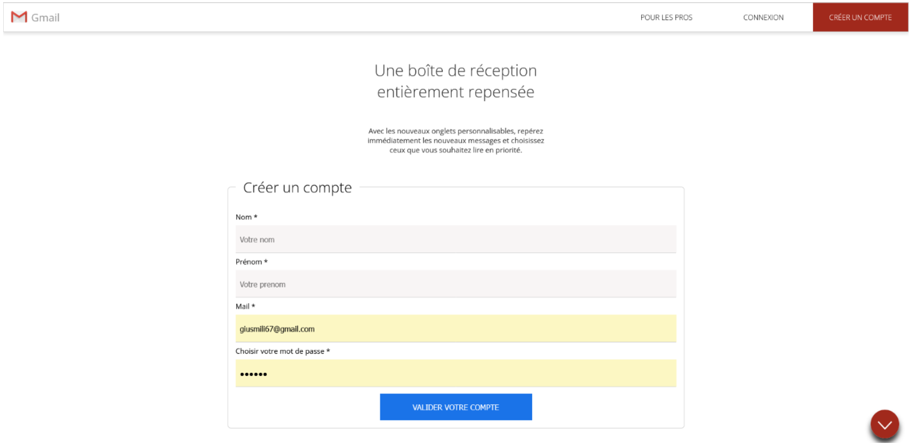
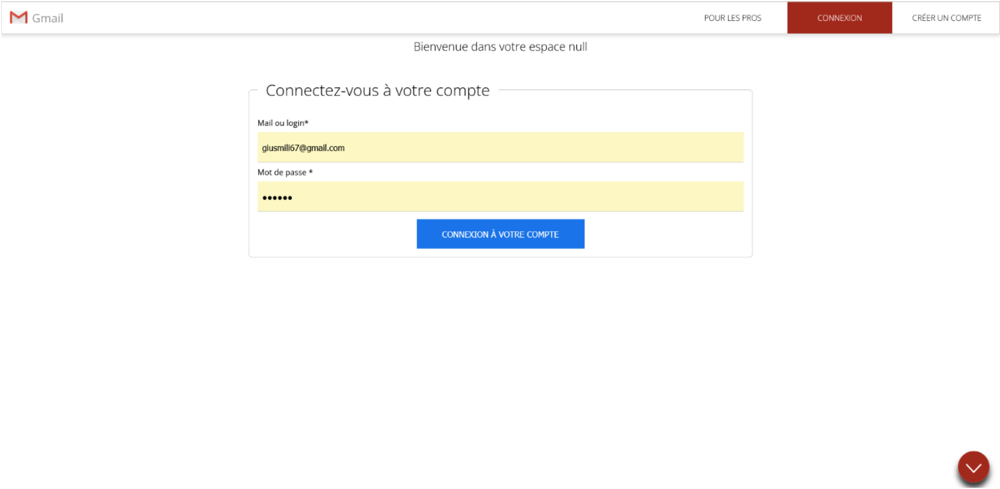
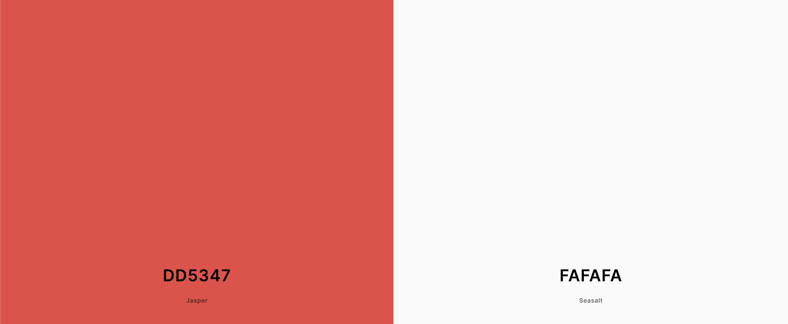
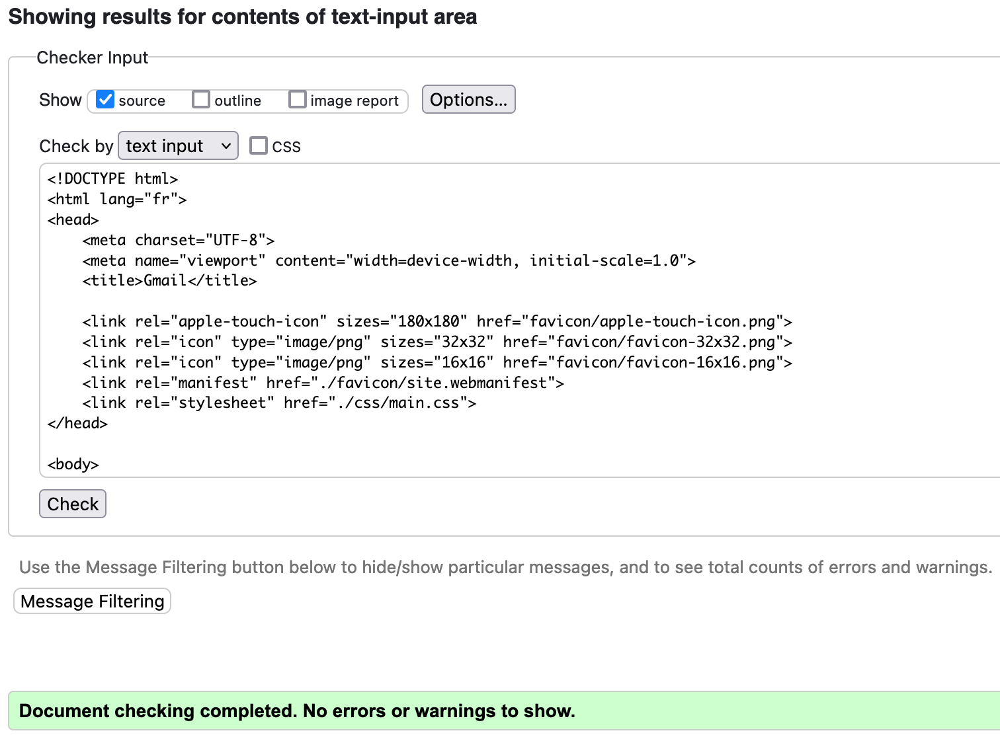

# Création d'une copie du site Gmail

[Lien vers le site](https://cynthiaapura.github.io/projet_gmail/)

## Présentation du projet

Dans le cadre de mon BTS SIO option développement, nous devons faire la copie de la page web du site Gmail, comme ci-dessous.

## Home page

## Créer un compte

## Connexion au compte

### Chartes graphique et typographique

**Police de caractère** : Open-Sans, sans-serif, 1.6rem

**Couleur des boutons et items** : #dd5347

**Couleur de fond** : #fafafa

**Le bolder** : 300 (font-weight)

_____ 
### Étape 1 : Partie statique

Dans un premier temps j'ai réalisé la maquette statique, en travaillant d'abord la partie HTML. Une fois que le code HTML validé sur le validateur W3C, j'ai pu faire le mise en forme en CSS.

Lorsque les deux étapes précedentes ont été finies et que le code HTML et CSS était bien validé, je me suis occupé de la partie dynamique en PHP.

### Étape 2 : Partie dynamique

Pour cette partie, j'ai découpé mon code en plusieurs templates que j'ai stocké dans le fichier "**src**". Après avoir fait le découpage, j'ai fais l'inclusion de chaques templates dans le fichier d'index.php.

< ici ajouter les screens de src et balise "include" du index.php >